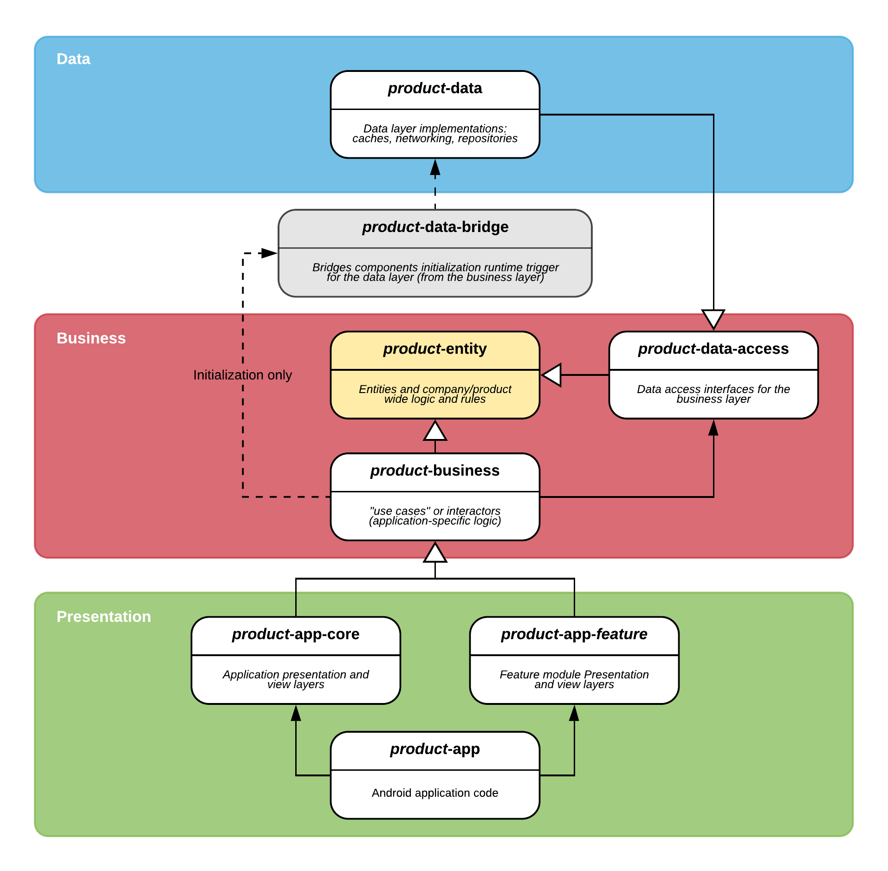

[](https://app.bitrise.io/app/f4515a5c1a063849)

# Clean Architecture on Android: the Teamwork.com way!
The purpose of this repository is to showcase, with a very simple (but hopefully clear) sample *Android* project, how we have implemented Uncle Bob's [Clean Architecture](https://8thlight.com/blog/uncle-bob/2012/08/13/the-clean-architecture.html) in our applications.

Given that broad nature of the topic and the amount of implementation details necessary to implement a working production project, we have simplified our example as much as possible and focused solely on the following areas:
- **Module structure:** each architecture layer has its own module, following closely the _Clean_ principles and naming.
- **Separation of layers**: how to configure Gradle making use of `api`/`implementation` to hide unwanted dependencies
- **Dependency Injection:** how to set up *Dagger 2* for a multi-module environment, but still ensuring the above point

## Our requirements
There is no such thing as *"the best architecture"* when it comes to mobile applications: the best architecture approach for a project (or team) always depends on a series of factors and assumptions.

Our solution is based on specific requirements, and, although it might not be the **silver bullet** for every project, it works well and could help you define your own architecture or, at least, inspire you to think about it a bit more.

We came up with our solution (and we iteratively try to improve it) based on the following items:
- **Software is our craft.** We aim for our applications to be fast, as bug-free as possible and always suiting our customers' needs: the only way to achieve that is to **ensure the quality and maintainability of our code through the use of best practices**.
- **We believe in code reusability.** Modularising components is the only way to ensure that our code is reusable across products, maximise our bandwidth as a team and ensure that bug fixes are promptly delievered to all of our clients.
- **Our applications are big.** Most of our applications are complex, with non-trivial logic and a significant amount of screens and use cases: **structuring our code in a formal and clear way is essential**.
- **Our applications should endure time.** We don't like technical debt, and we don't like rewriting the same software, using the same technologies, only because that code is broken.
- **We need to scale fast and make new developers onboarding smooth.** Using a shared, well-defined architecture helps new developers in the team, who should then be able to get into the codebase faster and contribute to it from the get-go.

## Modules
Listed below, a quick description of each module and a class diagram with their relationships.

### Modules relationships
The following diagram illustrates the above mentioned modules relationships in this sample project.
In order to support feature modules and (if properly configured) _Instant Apps_, the project's view/presentation layer is split into three modules; this is not a requirement and it can be avoided for small projects.



### Modules description

Module | Description | Module dependencies (direct or indirect)
------------- | ----------- | --------------------------
**-entity** | Business entities (the `Entity` layer in _Clean_) | _No dependencies_
**-data-bridge** | "Bridge" module only used for the initialization of the `Data` layer. Prevents implementation details in the data layer from being accessible in the business layer. | `data`, `data-access`, `entity`
**-data-access** | The `Data Access` layer, interfaces for the business layer to access the data layer | `entity`
**-data** | The `Data ` layer, which includes networking, caching and data delivery for the business layer to manipulate. Exposes via Dagger the `DataRepo` dependencies to the business layer | `data-access`, `entity`
**-business** | Business layer, contains interactors and business logic (which can then exposed to the presentation layer if necessary). | `business-injection`, `data-access`, `entity`
**-app-core** | Core, base module for the view and presentation layer. Contains themes, styles, resources, strings and components that are used across apps and feature modules. | `business`, `entity`
**-app-feature1** | View and presentation module for a "big" feature. This can be then extracted to use with _Instant Apps_ if desired | `app-core`, `business`, `entity`
**-app** | View and presentation layers for the _application module_ | `app-core`, `app-feature1`, `business`, `entity`

## Google Android Architecture Samples
Google has done a very good job at producing a set of code examples in their [Android Architecture Blueprints](https://github.com/googlesamples/android-architecture) repository.
We took inspiration from it (especially from the [todo-mvp-clean](https://github.com/googlesamples/android-architecture/tree/todo-mvp-clean/) and [todo-mvp-dagger](https://github.com/googlesamples/android-architecture/tree/todo-mvp-dagger/) branches), but found that the examples are quite simple and not suited for more complex applications.
More specifically:
- It is well suited for small projects, but the _"monolith module"_ approach doesn't scale well for medium/large applications
- The package-based separation of layers cannot be enforced at compile-time and is therefore very error-prone (especially when working in a big team)
- It is only a partial implementation of *Clean*: there is no real separation between presentation and business layer (*presenters* and *use cases*)
- It does not allow sharing code across applications, nor it is suitable for feature modules or _Instant Apps_

## Dependency Injection
Our *Gradle* modules use _**Dagger**_ (and its Android extension) for dependency injection. As an architectural choice to ensure encapsulation and enforce layer boundaries,
the modules at lower layers do not have access at compile time to the higher layers except its closest dependency (_see graph_ - i.e., the _presentation layer_ can only access the _business layer_, not the _data(-access) layer_).

Any exception to this rule must be explicitly declared and made available through a provision method in a public *component*. 
Dagger doesn't work well with this kind of requirement out of the box when using _Subcomponents_, since it needs to have access at compile time to all of the implementation classes to build the dependency graph (which is what we want to avoid in the first place).

### Goals
In order to allow using _Dagger_ with our encapsulation constraints, we ensure that:

#### Each layer owns its Dagger component
The Dagger `Component` is `internal`, and it is created and initialized within the module itself, so that each dependency graph is only fully visible inside the module. This guarantees encapsulation and allows us to declare both classes and the bound interfaces as `internal` if we don't want to provide access to them outside of the module.
Modules and dependencies are, by default, _only accessible by components in the same layer_.

#### Each layer's Dagger component inherits a public plain interface
This interface only includes the dependencies that we want to expose outside of the module, e.g.:
```
interface BusinessComponent {
    // provision methods for dependencies exposed to the presentation layer
}

@Component
internal interface InternalBusinessComponent : BusinessComponent
```

```
interface DataAccessComponent { // in the `data-access` module
    // provision methods for data layer dependencies exposed to the business layer
}

@Component // in the `data` module
internal interface DataComponent : DataAccessComponent
```

By doing so, we also encapsulate the usage of Dagger within the module itself, without forcing external "client code" to use the framework, and simplifying injecting a mock of the whole component for testing when needed.

#### Dependencies between layers are fully managed by Dagger
Each layer which has a direct dependency to a component from another layer, will declare so in its Dagger component as a [component dependency](https://dagger.dev/api/2.25.2/dagger/Component.html#dependencies):
```
@Component(modules = [...], dependencies = [DataAccessComponent::class])
internal interface InternalBusinessComponent : BusinessComponent
```

#### Component Factory
Dagger has recently introduced [component factories](https://dagger.dev/api/2.25.2/dagger/Component.Factory.html), which allow (sub)components to provide an interface, annotated with `@Component.Factory` (or `@Subcomponent.Factory`). The interface provides a single function, which contains dependencies (modules, components or any other) that the `Component` requires at dependency graph creation.
We use component factories to pass the components which are dependencies in the layer we are initialising, along with other classes that might be passed on from lower level layers (e.g. the application `Context`) with [@BindsInstance](https://dagger.dev/api/2.25.2/dagger/BindsInstance.html).
```
@Component(..., dependencies = [DataAccessComponent::class])
internal interface InternalBusinessComponent : BusinessComponent {

    @Component.Factory
    interface Factory {
        fun create(@BindsInstance applicationContext: Context,
                   dataAccessComponent: DataAccessComponent
        ): InternalBusinessComponent
    }
}
```

#### Initialization
**Note: initialization code is ugly!** The sample provides the simplest way to kick off the dependency graphs for each component and trigger initialization of dependencies that require it at application startup. Each project could require a different approach, the only requirement here is to follow the same layer initialisation order shown below.

The trigger for the initialization process is, as usual, the `Application.onCreate()` method.
In order to provide layer-specific initialization on each module, the sample provides a `SampleBusinessApplication` abstract class in the business layer, and a `SampleApplication` class, usually in the application module.
These classes provide callbacks to initialize the layers' components (in this order):
```
initializeDataComponent()
val businessComponent: BusinessComponent = initializeBusinessComponent()
initializeAppComponent(businessComponent) // the presentation/view layers need the business layer to be initialized
```

##### The `data-bridge` module
In order to fulfill the desired level of encapsulation dictated by Clean Architecture, the `data` layer is not directly accessible from other layers (and modules), and it's used by the business layer through the `data-access` layer.
The `data-bridge` only purpose is to temporarily "break" the dependency inversion rule at initialization time to provide a `DataBridgeInitializer` which calls to the `data` layer and triggers the Dagger dependency graph initialization for `DataComponent`:

##### Initialization steps
- **`data` layer** through the `data-bridge` module: `DataBridgeInitializer` calls to `DataLayerInitializer`, which executes the component factory's `create()` method for `DataComponent` and sets the singleton instance into `DataComponent.INSTANCE` and `DataAccessComponent.INSTANCE` (for access from the `business` layer)
- **`business` layer:** `BusinessLayerInitializer`, called by `SampleBusinessApplication`, which executes the component factory's `create()` method for `BusinessInternalComponent` and sets the singleton instance into `BusinessInternalComponent.INSTANCE` (`DataAccessComponent.INSTANCE` is passed to `create()`)
- **`presentation/view` layer:** `initializeAppComponent(businessComponent)` is called, and the `ApplicationComponent.create()` factory method is executed
Once all the Dagger dependency graphs are created, the application can then move on to the rest of its initialization process.

### Dependency Injection: example
We have three separate public Dagger `Component`s in our codebase: `ApplicationComponent` (view/presentation layer), `BusinessComponent` and `DataAccessComponent`.
These are declared in the corresponding layer's module to make sure that the Dagger annotation processor and compiler have access to all the required dependencies from the generated provider classes.

Let's take our `Feature2DetailsPresenter` example and follow its dependencies from the bottom-up in the architecture hierarchy:

#### Presentation layer
- When the default activity `Feature2DetailsActivity` is created, an injector method is called in the `onCreate()`
- An instance of `Feature2DetailsPresenter` must be created: the class has an `@Inject` constructor that Dagger uses to instantiate it
- `Feature2DetailsInteractor` is required by the constructor: we need to access the class provider, which is declared in `BusinessComponent`
- A named `GLOBAL_COMPUTATION_EXECUTOR` is also injected in the constructor. Note that this is provided by `BusinessComponent` but exposed all the way from `DataAccessComponent` (this kind of transitive dependency is sometimes useful)

#### Business layer
- `BusinessComponent` exposes `Feature2DetailsInteractor` via a provision method (`feature2DetailsInteractor()`)
- Interactor bindings between interface and concrete implementation are declared in `InteractorsBindingModule` (`Feature2DetailsInteractor` binds to `Feature2DetailsInteractorImpl`)
- The bound implementation `Feature2DetailsInteractorImpl` has dependencies from the data access layer: `Entity1Repo` is one of those
- `Feature2DetailsInteractorImpl` also requires `InternalInteractor`, which is bound in `InteractorsBindingModule`, but *not* exposed in `BusinessComponent` (but available in `InternalBusinessComponent`)

#### Data Access / Data (Bridge) layer
- The Dagger component `DataComponent` extends from the `DataAccessComponent`: all the provision methods for data access layer classes which are needed in the business layer are available here
- `DataAccessComponent` exposes the needed provision method: `entity1Repo(): Entity1Repo`
- `SampleDataComponent` includes `DataRepoBindingModule`, which, finally, contains the binding method which provides an instance of `Entity1RepoImpl` for the `Entity1Repo` interface

## Other references
- Fabio Collini's excellent article [Implementing Dependency Inversion using Dagger components](https://medium.com/google-developer-experts/implementing-dependency-inversion-using-dagger-components-d6b0fb3b6b5e)
- Fabio Collini's presentation on [SOLID and Clean Architecture on Android](https://www.youtube.com/watch?v=GlDsfq3xHvo)

## License

    Copyright 2018-2019 Teamwork.com

    Licensed under the Apache License, Version 2.0 (the "License");
    you may not use this file except in compliance with the License.
    You may obtain a copy of the License at

        http://www.apache.org/licenses/LICENSE-2.0

    Unless required by applicable law or agreed to in writing, software
    distributed under the License is distributed on an "AS IS" BASIS,
    WITHOUT WARRANTIES OR CONDITIONS OF ANY KIND, either express or implied.
    See the License for the specific language governing permissions and
    limitations under the License.
