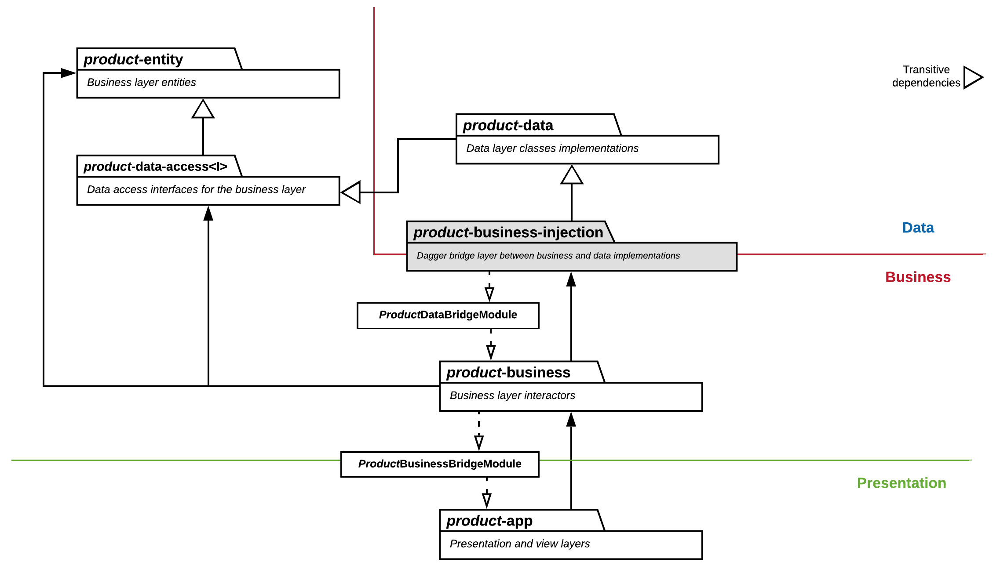

# Clean Architecture on Android: the Teamwork.com way!
The purpose of this repository is to showcase, with a very simple (but hopefully clear) sample *Android* project, how we have implemented Uncle Bob's [Clean Architecture](https://8thlight.com/blog/uncle-bob/2012/08/13/the-clean-architecture.html) in our applications.

Given that broad nature of the topic and the amount of implementation details necessary to implement a working production project, we have simplified our example and focused solely on the following areas:
- **Module structure:** each architecture layer has its own module, following closely the _Clean_ principles and naming.
- **Separation of layers**: how to configure Gradle making use of `api`/`implementation` to hide unwanted dependencies
- **Dependency Injection:** how to set up *Dagger 2* for a multi-module environment, but still ensuring the above point

## Our requirements
There is no such thing as *"the best architecture"* when it comes to mobile applications: the best architecture approach for a project (or team) always depends on a series of factors and assumptions.

Our solution is based on specific requirements, and, although it might not be the **silver bullet** for every project, it works well and could help you define your own architecture or, at least, inspire you to think about it a bit more.

We came up with our solution (and we iteratively try to improve it) based on the following items:
- **Software is our craft.** We aim for our applications to be fast, as bug-free as possible and always suiting our customers' needs: the only way to achieve that is to **ensure the quality and maintainability of our code through the use of best practices**.
- **We believe in code reusability.** Modularising components is the only way to ensure that our code is reusable across products, maximise our bandwidth as a team and ensure that bug fixes are promptly delievered to all of our clients.
- **Our applications are big.** Most of our applications are complex, with non-trivial logic and a significant amount of screens and use cases: **structuring our code in a formal and clear way is essential**.
- **Our applications should endure time.** We don't like technical debt, and we don't like rewriting the same software, using the same technologies, only because that code is broken.
- **We need to scale fast and make new developers onboarding smooth.** Using a shared, well-defined architecture helps new developers in the team, who should then be able to get into the codebase faster and contribute to it from the get-go.

## Modules
Listed below, a quick description of each module and a class diagram with their relationships.

### Modules description

Module name | Description | Module dependencies (direct or indirect)
------------- | ----------- | --------------------------
**sample-entity** | Business entities (the `Entity` layer in _Clean_) | _No dependencies_
**sample-data-access** | The `Data Access` layer, interfaces for the business layer to access the data layer | `sample-entity`
**sample-data** | The `Data ` layer, which includes networking, caching and data delivery for the business layer to manipulate. Exposes via Dagger the `DataRepo` dependencies to the business layer | `sample-data-access`, `sample-entity`
**sample-business-injection** | Bridge module between the data and the business layer. Prevents implementation details in the data layer from being accessible in the business layer, and exposes the repositories exposed through the data access layer | `sample-data`, `sample-data-access`, `sample-entity`
**sample-business** | Business layer, contains interactors which are then exposed to the presentation layer. | `sample-business-injection`, `sample-data-access`, `sample-entity`
**sample-app-core** | Core, base module for the view and presentation layer. Contains themes, styles, resources, strings and components that are used across apps and feature modules. | `sample-business`, `sample-entity`
**sample-app-feature1** | View and presentation module for a "big" feature. This can be then extracted to use with _Instant Apps_ if desired | `sample-app-core`, `sample-business`, `sample-entity`
**sample-app** | View and presentation layers for the _application module_ | `sample-app-core`, `sample-app-feature1`, `sample-business`, `sample-entity`

### Modules relationships
The following diagram illustrates the above mentioned modules relationships in this sample project.
In order to support feature modules and (if properly configured) _Instant Apps_, the project's view/presentation layer is split into three modules (`sample-app`, `sample-app-core` and `sample-app-feature1`).
For simplicity's sake, these modules are not listed separately in the diagram, but grouped as `product-app`.

## Google Android Architecture Samples
Google has done a very good job at producing a set of code examples in their [Android Architecture Blueprints](https://github.com/googlesamples/android-architecture) repository.
We took inspiration from it (especially from the [todo-mvp-clean](https://github.com/googlesamples/android-architecture/tree/todo-mvp-clean/) and [todo-mvp-dagger](https://github.com/googlesamples/android-architecture/tree/todo-mvp-dagger/) branches), but found that the examples are quite simple and not suited for more complex applications. More specifically:
- It is well suited for small projects, but the _"monolith module"_ approach doesn't scale well for medium/large applications
- The package-based separation of layers cannot enforced and is therefore very error-prone (especially when working in a big team)
- It is only a partial implementation of *Clean*: there is no real separation between presentation and business layer (*use cases*)
- It does not allow sharing code across applications, nor it is suitable for feature modules or _Instant Apps_

## Dependency Injection
Our *Gradle* modules use _**Dagger**_ (and its Android extension) for dependency injection. As an architectural choice to ensure encapsulation and enforce layer boundaries,
the modules at lower layers do not have access at compile time to the higher layers except its closest dependency (_see graph_ - i.e., the _presentation layer_ can only access the _business layer_, not the _data layer_).

Any exception to this rule must be explicitly declared and made available through dependency injection. Dagger doesn't currently support well this kind of requirement out of the box, and it makes really hard to structure the dependency graph using the traditional _Subcomponents_ or _component dependencies_.

In order to allow using _Dagger_ with our class visibility constraints, we have devised a more verbose (and certainly less "elegant") configuration which overcomes this limitations.

### Dependency Injection constraints
To ensure _Dagger_ is still able to build the dependency graph after our layer separation, additional configuration to its `Component`s is necessary.
- Each main layer _application_ (_presentation_), _business_ and _data_ have an entirely separate `Component`
- Modules and dependencies are, by default, _only accessible by components in the same layer_
- To make a module available to the immediate lower layer (**bridge module**), it needs to be public, call back to the `Component` in the upper architecture layer and must be added to the component where it will be accessed
- To make dependencies available to the immediate lower layer, they need to be added to one of the above bridge modules, exposed in their native `Component` (via a [provision method](https://google.github.io/dagger/api/2.14/dagger/Component.html))

## License

    Copyright 2018 Teamwork.com

    Licensed under the Apache License, Version 2.0 (the "License");
    you may not use this file except in compliance with the License.
    You may obtain a copy of the License at

        http://www.apache.org/licenses/LICENSE-2.0

    Unless required by applicable law or agreed to in writing, software
    distributed under the License is distributed on an "AS IS" BASIS,
    WITHOUT WARRANTIES OR CONDITIONS OF ANY KIND, either express or implied.
    See the License for the specific language governing permissions and
    limitations under the License.
